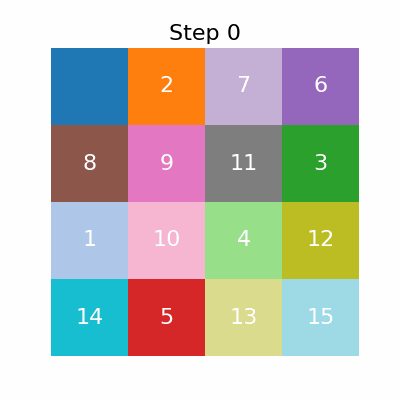
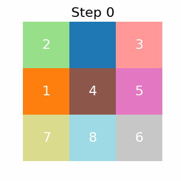

# CI2024_lab3 - N-Puzzle Problem solution



Implementing multiple algorithm to find a solution for the N-Puzzle problem

Description for N=15 : [`https://en.wikipedia.org/wiki/15_puzzle`](https://en.wikipedia.org/wiki/15_puzzle)

Since Keith Conrad proved that some configuration of the 15-Puzzle (and rubik's cube) cannot be solved: [`https://kconrad.math.uconn.edu/blurbs/grouptheory/15puzzle.pdf`](https://kconrad.math.uconn.edu/blurbs/grouptheory/15puzzle.pdf)

This algorithm start by creating the solution state and, making only legal moves to create the starting position, will create a starting state and only from that it will try to find the best moves to solve the problem.

If the algorithm didn't find any solution I miserably failed in the implementation :P


## Algorithm At work

Running the notebook this is the output you should expect:<br><br>

**Solution Grid** (4x4)

$$\begin{bmatrix}
  1  & 2  & 3  & 4       \\
  5  & 6  & 7  & 8       \\
  9  & 10 & 11 & 12      \\
  13 & 14 & 15 & \square
  \end{bmatrix}$$

**Starting State** (moves=20)

$$\begin{bmatrix}
  1  & 2  & 4       & 7  \\ 
  5  & 6  & 3       & 8  \\ 
  9  & 14 & \square & 11 \\ 
  13 & 15 & 10      & 12
\end{bmatrix}$$


| Dimension | Quality | Cost  |
| --------- | ------- | ----- |
| 4x4       | 13      | 34728 |




## Data Analysis
| Dimension | Quality | Cost  |
| --------- | ------- | ----- |
| 2x2       | 5       | 7     |
| 3x3       | 11      | 575   |
| 4x4       | 13      | 34728 |

> [!WARNING]
> As you can see the cost increase exponentially. <br>
> Keep in mind if you want to run $\ge 4$ dimensions to set a manual amount of moves (around 10 to 15).


## Installation
Using poetry just run `poetry install` and then the .venv will be created inside the project, after that using any tool you want, enable the new virtual environment to run the `n-puzzle.ipynb`

## Running the Solution

You are free to experiment and try different problem settings

In the notebook go to the latest cell and you will be greeted by:

```python
dimension = 3
# moves = 15
# The max number of moves required to solve the puzzle, so scramble the grid with this number of moves
# to a fairly random starting point
# https://puzzling.stackexchange.com/a/5477
moves = dimension * dimension * (dimension - 1)


# Generate a NxN solution grid in order from 0 to dimension^2 - 1
goal_state: NDArray[np.int32] = generate_goal_state(dimension)

# Generate a NxN grid of random numbers from 0 to dimension^2 - 1
initial_state: NDArray[np.int32] = scramble_state(goal_state, moves)

print(f"Starting Grid ({dimension}x{dimension}):")
print(initial_state, end="\n\n")
print(f"Solution Grid ({moves=}):")
print(goal_state)
print(f"|{"-"*(dimension*2+5)}|")

# Solve using Breadth First Search
bfs_solver = BFS(initial_state, goal_state)

result = bfs_solver.solve()

if result.get("valid"):
    path, quality, cost = result.get("path"), result.get("length"), result.get("cost")

    print(f"Quality: {quality}")
    print(f"Cost: {cost}")
    if isinstance(path, list):
        save_solution_gif(path)
```

the first line let you setup the dimension of the grid, then you can choose:
1. Use your custom number of moves: reduce the solution time (thus the initial entropy of the system) but the result are underwhelming as you can see below
   
2. Leave the formula (open the link and understand what it is doing) and make the (i hope) best random starting configuration
   

Then you can choose one of the two kind of the same *Breadth-First Solver*
* Linear: each new node is analyzed one after the another
  * `bfs_solver.solve(n_jobs=1)`: It's the default value, so really you can avoid passing any argument
* Parallel: multiple node analyzed at the same time
  * `bfs_solver.solve(-1)` or set the actual number of of core you want to use

> [!NOTE]
> In my testing the Parallel performed worse.<br>
> Maybe the overhead to instantiate multiple jobs was too much with respect of the amount of node to analyze simultaneously
> Still I think it was worth trying and thus leaved there so that You can playing around if you like

To that solver you have to pass the starting and goal state, this step is automatized based on dimension and number of moves, but if you want to make your custom starting and ending state feel free to do that!

> [!IMPORTANT]  
> Starting and Goal State need to have the same dimension and to be squared: (Always $N \times N$ matrices, never $N \times M => N \neq M$)<br>
> If you provide an impossible problem the algorithm will try every possible path, thus taking a really long time before printing `"BFS: No solution found"`

The last line lets you modify the name of the output gif to be sure I didn't cheat with a prerecorded solution :P

### **Have fun!**